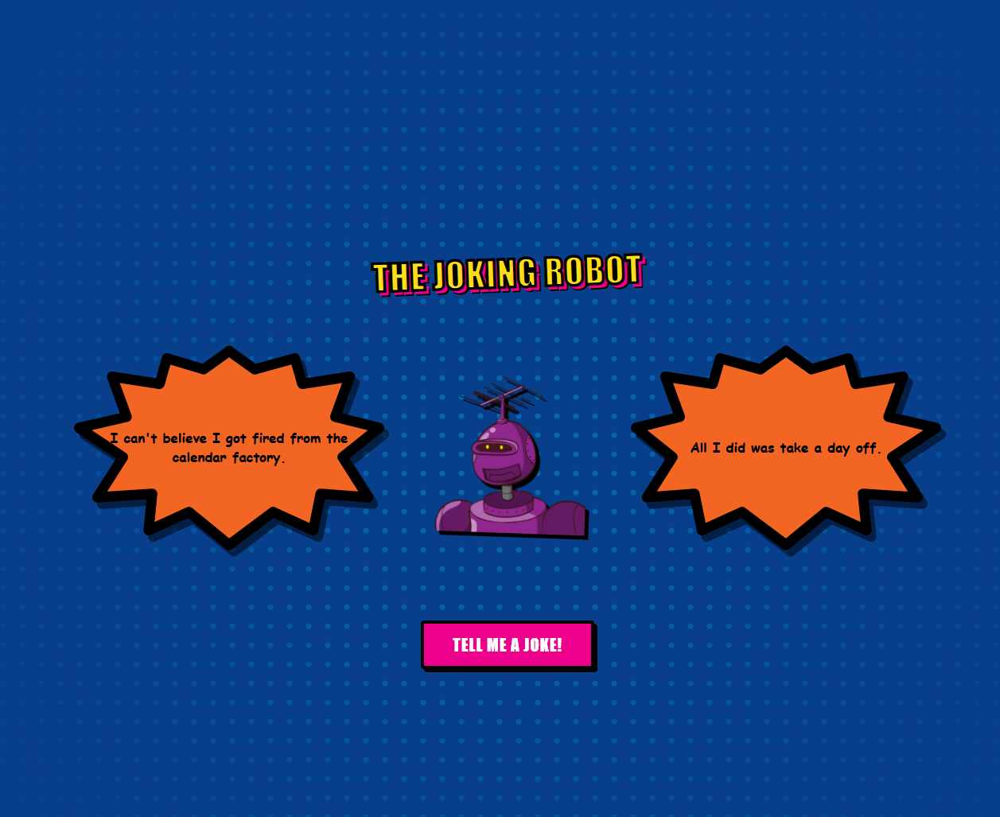

# The-Joking-Robot
An interactive, pop-art web app featuring a customizable comic-book robot.

  

Table of Contents

- [Project Details](#project-details)
- [Description](#description)
- [Instructions to Run the App](#instructions-to-run-the-app)
- [Usage](#usage)
- [Features](#features)
- [Architecture & Tech Stack](#architecture--tech-stack)
- [Additional Notes](#additional-notes)

---

## Project Details

### Name
The Joking Robot

### Version
1.1.0

---

## Description
The Joking Robot is a responsive single-page web application that blends classic silver-age comic book aesthetics with real-time text delivery. Powered by programmatic API requests, the application surfaces a collection of tech-focused, single-part, and two-part jokes, rendering them dynamically inside procedurally configured, vector-drawn speech bubbles alongside uniquely generated cybernetic character assets.

---

## Instructions to Run the App

### Live Browser Environment
1. Double-click the `index.html` file within the project directory to open it locally in any modern desktop or mobile web browser.

### VS Code (Live Server)
1. Open the project folder in **VS Code**.
2. Install the **Live Server** extension if not already present.
3. Click the **Go Live** button in the bottom status bar or right-click `index.html` and select **Open with Live Server**.

---

## Usage
1. Initialize the interface by loading the application; a distinct robot avatar will fetch automatically.
2. Click the prominent pink **"Tell Me A Joke!"** action button.
3. Observe the asynchronous payload request process: the top speech bubble will load a setup statement or single-line narrative.
4. If a two-part joke structure is fetched, a secondary layout space will dynamically generate on the opposite side of the center profile, formatting the punchline text securely inside an inverted vector frame.

---

## Features
* [x] **Asynchronous API Delivery**: Connects to external JSON joke frameworks using native Fetch architecture.
* [x] **Dynamic Vector Scaling**: Auto-calculates text-string volume to scale font layouts down cleanly, eliminating overflowing scrolling artifacts.
* [x] **Inward-Facing Bubble Tail Matrix**: Utilizes programmatic CSS `matrix()` and horizontal SVG translation transforms to guarantee speech bubble tails always index squarely toward the central anchor point.
* [x] **Procedural Asset Pipeline**: Interacts with the `robohash.org` API engine to load varied character profiles using unique randomized seeding values on every action hook.
* [ ] **Audio Speech-Synthesis Implementation**: Future iteration to handle programmatic Text-to-Speech playback.

---

## Architecture & Tech Stack
* **Markup & Semantics**: HTML5 (Native `<svg>` vector graphics components using explicit canvas viewbox structures)
* **Styling Framework**: Pure CSS3 (Featuring Custom Variables/Tokens, Multi-layered CSS Grid/Flexbox scaffolding, Responsive fluid viewports)
* **Logic Engine**: Vanilla ECMAScript 6+ (Promises, Async/Await syntax, Inline DOM attribute modifications)

---

## Additional Notes
* The application runs purely client-side; no localized servers, Node environment pipelines, or runtime dependencies are required to initialize the primary deployment layer.
* SVG elements use an internal structural `<g>` definition wrapper layer which acts as a vector canvas flip container, stabilizing performance across legacy mobile browsers.
* Future update in the works to improve speech bubble presentation
